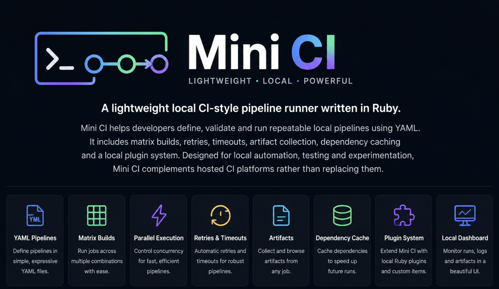

# Mini CI

[](https://github.com/amirabenbouali/miniCI/actions/workflows/ci.yml)


<p align="center">
  
</p>

Mini CI is a lightweight local CI-style pipeline runner written in Ruby.

Mini CI helps developers define, validate and run repeatable local pipelines with YAML, matrix builds, retries, timeouts, artifacts, caching and plugins. It is not a replacement for hosted CI systems; it is a focused developer tool for local automation.

## Why Mini CI?

- Test CI-style workflow ideas without a remote service.
- Keep local automation readable with a small YAML format.
- Demonstrate production-minded Ruby design: validation, process handling, caching, artifacts, plugins, docs, packaging and CI.
- Run polished examples that are fast enough for demos and screen recordings.

## Features

| Capability | Status |
| --- | --- |
| YAML pipelines | Supported |
| Global and item environments | Supported |
| Setup and cleanup hooks | Supported |
| Timeouts | Supported |
| Retries | Supported |
| Conditional execution | Supported |
| Matrix builds | Supported |
| Controlled parallel matrix workers | Supported |
| Artifacts | Supported |
| Local dependency cache | Supported |
| Local Ruby plugins | Supported |
| Run history | Supported |
| Local dashboard | Supported |
| Remote workers | Not supported |
| Cloud execution | Not supported |
| Secret vault | Not supported |

## Quick Start

Install dependencies from a checkout:

```bash
bundle install
```

Run the showcase pipeline:

```bash
bundle exec bin/mini-ci run examples/showcase-pipeline.yml --concurrency 2
```

The showcase runs two matrix jobs, prepares a workspace, executes checks with retry metadata, collects artifacts, and runs cleanup hooks.

After installing the gem locally:

```bash
mini-ci run examples/showcase-pipeline.yml --concurrency 2
```

## Example Pipeline

```yaml
name: Example

env:
  APP_ENV: test

steps:
  - name: Check Ruby
    run: ruby --version

  - name: Run tests
    run: bundle exec rspec
    timeout: 60
    retries: 1
```

Run it:

```bash
mini-ci validate mini-ci.yml
mini-ci list mini-ci.yml
mini-ci run mini-ci.yml
```

## Installation

From the repository:

```bash
bundle install
gem build mini_ci.gemspec
gem install ./mini_ci-1.0.0.gem
mini-ci version
```

Mini CI supports Ruby 3.1 and newer.

## Commands

```bash
mini-ci help
mini-ci version
mini-ci validate [FILE]
mini-ci list [FILE]
mini-ci run [FILE]
mini-ci cache list
mini-ci cache clear --yes
mini-ci plugins list
mini-ci plugins validate
mini-ci dashboard
```

Each command supports command-level help:

```bash
mini-ci run --help
mini-ci cache --help
mini-ci plugins --help
mini-ci dashboard --help
```

`FILE` defaults to `pipeline.yml`.

Stable exit codes:

| Code | Meaning |
| --- | --- |
| `0` | Success |
| `1` | Pipeline or runtime failure |
| `2` | Configuration, validation, plugin load, or usage error |
| `3` | Internal Mini CI error |
| `130` | Interrupted by the user |

Use `--debug` with any command to print exception details for unexpected internal errors:

```bash
mini-ci --debug run pipeline.yml
mini-ci run pipeline.yml --debug
```

## Configuration

The full stable YAML format is documented in [docs/configuration.md](docs/configuration.md).

Top-level fields:

```yaml
name:
env:
concurrency:
matrix:
before_all:
steps:
after_all:
```

Pipeline item fields:

```yaml
name:
run:
uses:
with:
env:
timeout:
retries:
retry_delay:
when:
if:
artifacts:
cache:
```

## Matrix Builds

Matrix definitions expand in deterministic Cartesian-product order. Matrix values are exposed as environment variables with the `MATRIX_` prefix.

```yaml
name: Matrix Example
concurrency: 2

matrix:
  track:
    - ruby-3.1
    - ruby-3.2

steps:
  - name: Print track
    run: echo "$MATRIX_TRACK"
```

Matrix jobs may run in parallel, but every command still runs locally on the same machine.

## Artifacts

Items can collect files after execution:

```yaml
steps:
  - name: Generate report
    run: bash scripts/showcase_report.sh
    artifacts:
      when: always
      paths:
        - tmp/showcase/reports/
```

Artifacts are stored under `.mini-ci/artifacts/` by default. Matrix jobs receive isolated artifact directories.

## Caching

Mini CI supports a local filesystem dependency cache:

```yaml
steps:
  - name: Install dependencies
    run: bundle install
    cache:
      key: bundle-${{ checksum("Gemfile.lock") }}
      restore_keys:
        - bundle-
      paths:
        - vendor/bundle
```

The cache is local only. There is no remote cache server or distributed cache.

## Plugins

Mini CI can load trusted local Ruby plugins from `.mini-ci/plugins/`, `--plugin-dir`, or `--plugin`.

Plugins are arbitrary Ruby code and are not sandboxed. Only load plugins you trust.

Plugin API version `1` is part of the v1.0 compatibility surface. Internal Ruby class constructors are not.

## Examples

The flagship demo is:

```bash
bundle exec bin/mini-ci run examples/showcase-pipeline.yml --concurrency 2
```

See [examples/README.md](examples/README.md) for every committed example, what it demonstrates, required plugin flags, and expected exit code.

## Dashboard

Start the local dashboard:

```bash
mini-ci dashboard
```

Default address:

```text
http://127.0.0.1:4567
```

The dashboard shows run history, output logs, artifacts, run details, matrix jobs, and local JSON endpoints. It has no authentication and is intended for trusted local development only. Binding to a non-loopback host prints a warning.

## Architecture

See [docs/architecture.md](docs/architecture.md) for the execution flow and component responsibilities.

## Security

See [SECURITY.md](SECURITY.md). Mini CI runs shell commands and trusted local plugins with the permissions of the current user. It does not provide a secret vault, container isolation, or remote execution sandbox.

## Limitations

- Local execution only.
- Shell commands run with the current user's permissions.
- Plugins are trusted arbitrary Ruby code.
- No secret vault or `.env` loading.
- No remote runners, hosted service, or distributed cache.
- No isolation between matrix jobs beyond environment merging, process controls, and per-job artifact paths.
- In-process plugin handlers do not support forced timeouts.
- The dashboard has no authentication.
- Stopping the dashboard may interrupt dashboard-managed runs.

## Release Readiness

Release notes live in [docs/releases/v1.0.0.md](docs/releases/v1.0.0.md). The release checklist lives in [docs/release-checklist.md](docs/release-checklist.md).

Suggested GitHub repository description:

```text
Lightweight local CI pipeline runner written in Ruby with matrix builds, caching, artifacts and plugins.
```

Suggested topics:

```text
ruby, ci, continuous-integration, developer-tools, automation, yaml, pipeline, cli, matrix-builds, testing, build-system
```

## Roadmap

- Keep the v1.0 CLI and YAML format stable.
- Harden process interruption and dashboard-managed cancellation.
- Improve release packaging and GitHub Release assets.
- Explore future workflow features only when they fit Mini CI's local-first scope.

## Contributing

See [CONTRIBUTING.md](CONTRIBUTING.md).

## Licence

Mini CI is released under the MIT Licence. See [LICENSE](LICENSE).
